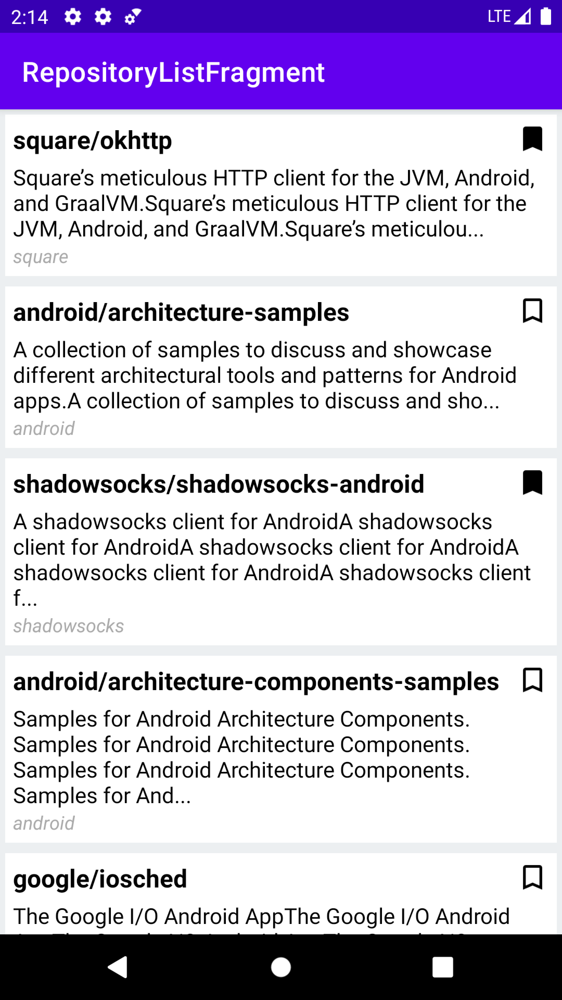
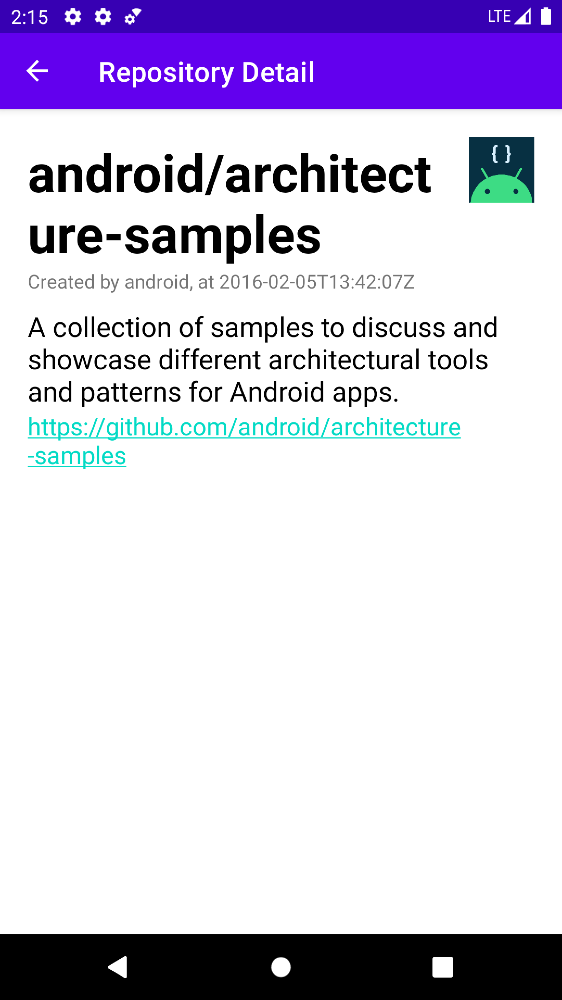
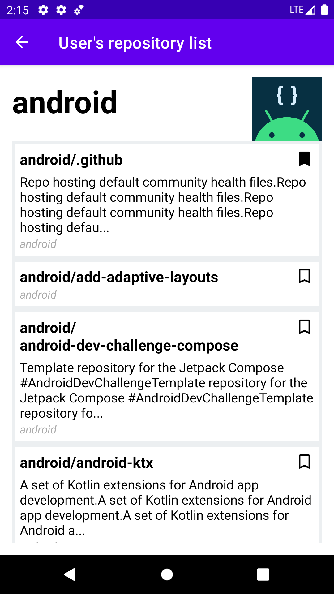
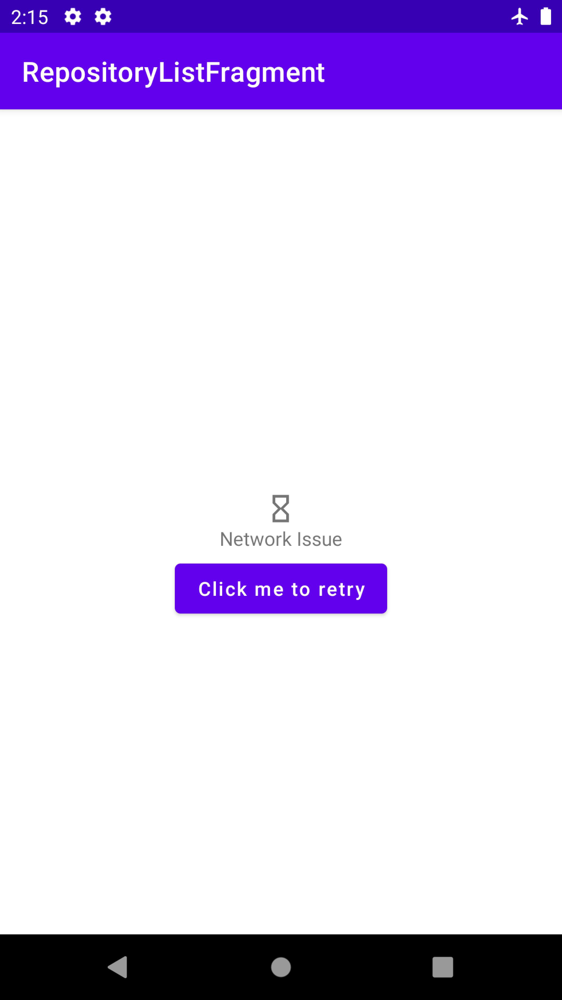
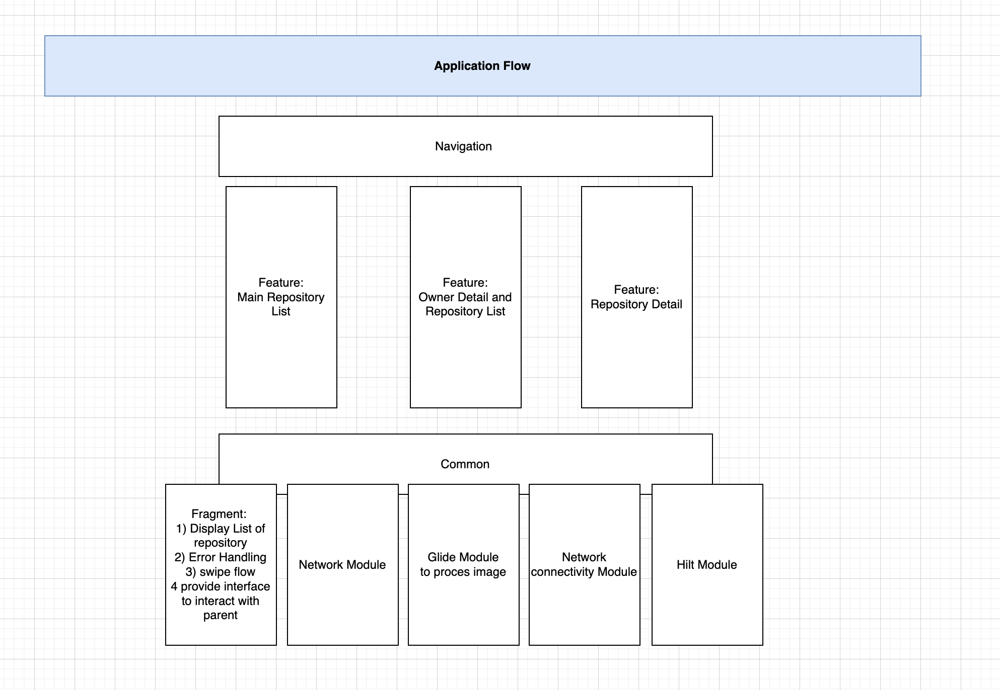
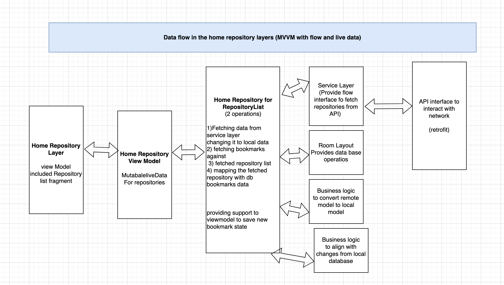
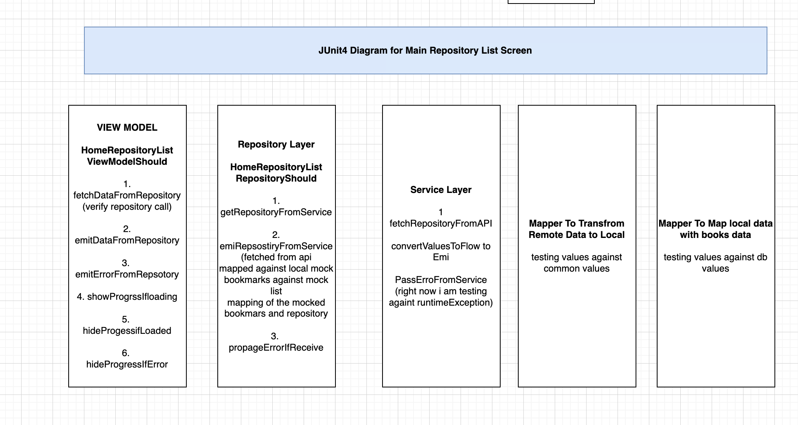
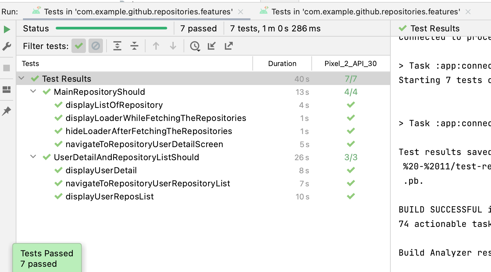
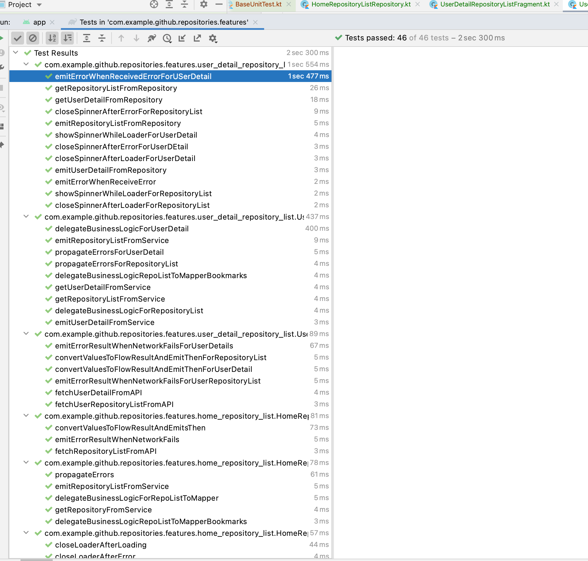
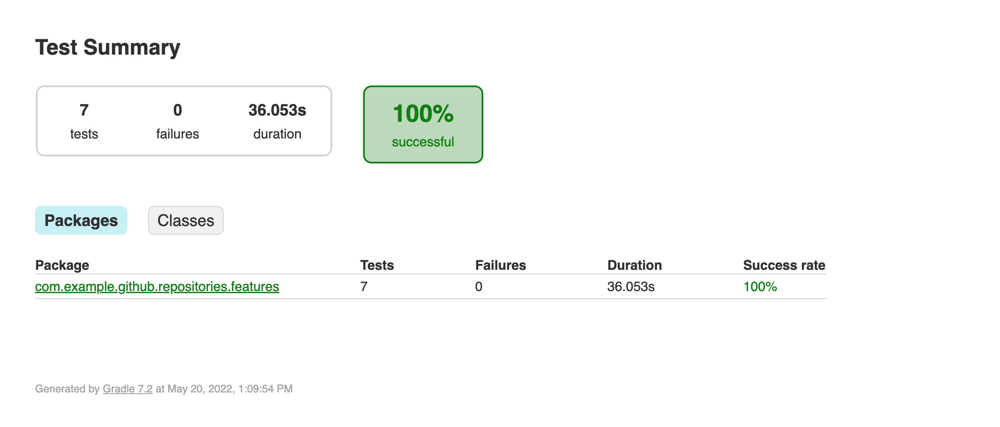

# Github Repository Challenge by Rakuten with Clean architecure (MVVM with kotlin) using test-driven apporach

Implemented an Android app with Kotlin that displays the information retrieved from the Github API, it covers following points

Applications is showing github repositories as well as saving the bookmarks detail in local db.

## Components in the application

- **Screen Home Repository List**
    1. ViewModel implementation (6 JUnit Test)
    2. Repository Layer. (5 Junit Test)
    3. Service Layer (3 Junit Test)
    4. Room Layer (database layer)
    5. Business Logic: Mapper to transfrom data from remote to local  & Mapper to embbed bookmarks into api data (2 Junit Test)

- **Screen Owner Detail List**
    1. Simple Fragment just displayed fetched data

- **Screen Owner Detail And Repository List**
    1. ViewModel implementation (8 JUnit Test)
    2. Repository Layer. (10 Junit Test)
    3. Service Layer (6 Junit Test)
    4. Room Layer (database layer)
    5. Business Logic: Mapper to transfrom data from remote to local  & Mapper to embbed bookmarks into api data (2 Junit Test)

- **Common**
- View
    1. Common view (Fragment for Repository List)
    2. Modules (Glide, NetworkConnectivity, NetworkClient (retrofit)

**Key feature in the application**

- MVVM Design Architecture used with additional mappers as business logic layer
- Kotlin Flow.
- Hilt.
- JetPack Navigation.
- Data Github libraries
- Test Driven Development(Junit & espresso).

## Screenshots

## Architecture

## UI Testing Screenshot
**7 UI tests** with complete with clear and simple to understand test names, UI test need the network support because it is comparing the data

## Unit Testing Screenshot
**46 Junit tests** with complete with clear and simple to understand test names

## Code Coverage
A coverage report can be generated using `gradlew createDebugCoverageReport`command-line via Gradle

## Not addressed issues
- Separation of applications in separate multiple modules based upon their names
- Replace of LiveData with StateFlow
- More JUnit Test cases
